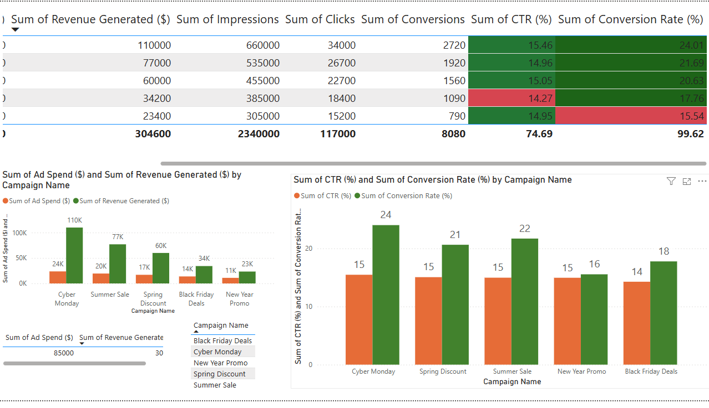

# 📊 Power BI Marketing Dashboard

## 📌 Overview
This Power BI dashboard analyzes **marketing campaign performance**, focusing on:
- 📈 **Ad Spend vs. Revenue Analysis**
- 📊 **CTR (%) & Conversion Rate (%) Trends**
- 🎨 **Conditional Formatting for Insights**
- 🔄 **Interactive Campaign Filtering**

## 📂 Files
- `Marketing_Campaign_Performance.pbix` → Power BI Dashboard file
- 

## 🚀 How to Use
1️⃣ Download the `.pbix` file  
2️⃣ Open in **Power BI Desktop** (Free from Microsoft)  
3️⃣ Explore interactive visualizations!  

## 🔥 Key Insights
- **Cyber Monday** had the **highest ROI** with **$110K revenue**.
- The **highest CTR was 15.46%**, indicating a strong engagement.
- **Conditional formatting** highlights weak-performing campaigns in **red**.

---
🔗 **GitHub Repo:** [PowerBI-Marketing-Dashboard](https://github.com/savithakandugula/PowerBI-Marketing-Dashboard)

